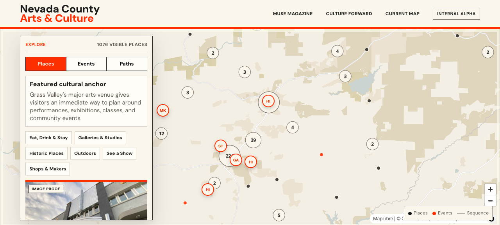
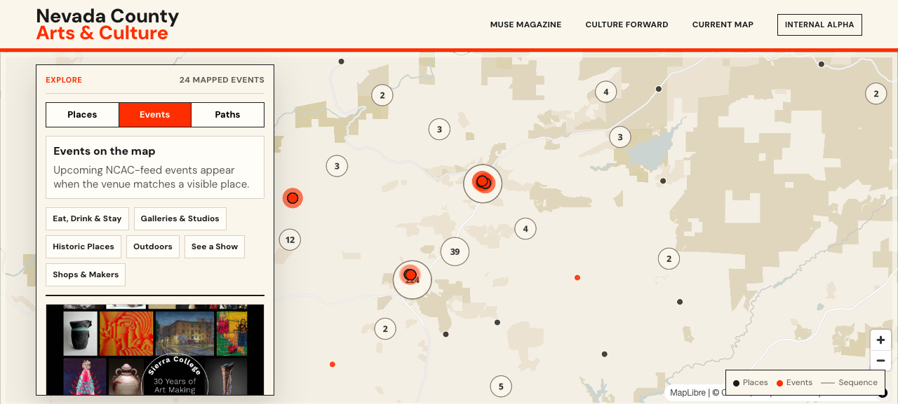
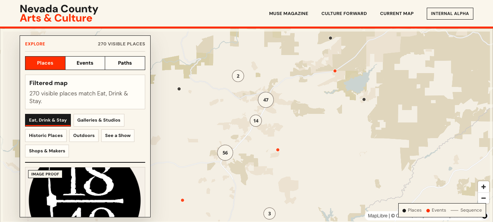

# V1 Discovery Map Next Review Package

Status: ready for next NCAC review slice  
Date: 2026-05-25  
Source artifact: `website/cultural-map-redesign-stitch-lab/v1-discovery-map/`

## Review Purpose

This package frames the current V1 Discovery Map as an internal alpha for stakeholder review. The slice is ready to evaluate the authored cultural discovery direction: featured cultural anchors, curated paths, mapped events, visitor-interest filters, and visible data gaps.

## What Changed

- The map now opens with an authored place card instead of a generic empty-state panel.
- Six Primary Anchors are visually emphasized with restrained marker treatment and richer detail cards.
- Four additional Supporting Stops carry contextual card treatment without being promoted to Primary Anchor status.
- Curated paths now have clearer stop treatment and cultural context.
- MUSE evidence has been linked into the V1 data layer so anchor and theme copy can be traced back to source material.
- The last QA pass findings were resolved: the Sierra College event copy is corrected, and place filters no longer leave a mismatched selected card visible.

## Current Review Surface

| Area | Current State |
|------|---------------|
| Places | 1,076 visible mapped places |
| Events | 24 mapped events from the current event feed |
| Curated paths | 4 paths |
| Primary Anchors | 6 featured anchor places |
| Supporting Stops | 4 contextual stop cards |
| MUSE evidence | 1,126 evidence links plus a 6-anchor theme map |

## Suggested Review Flow

1. Start on the default Places view and review the first featured anchor card.
2. Use `View on map` to confirm the anchor relationship between the card and map marker.
3. Try visitor-interest filters, especially `Eat, Drink & Stay`, and confirm the detail card stays aligned with the filtered map.
4. Switch to Events and review the first event card for tone, usefulness, and data trust.
5. Switch to Paths and review whether the stop sequence feels like a curated cultural invitation rather than a generic route list.
6. Discuss whether the current Primary Anchor / Supporting Stop distinction is clear enough for NCAC review.

## Screenshots

### Default Places View

### Events View

### Filtered Places View

## QA Status

Passed for this review slice:

- The #29 event-copy finding is resolved.
- The #30 filtered-detail finding is resolved.
- JavaScript syntax check passed.
- Event data guard passed for the corrected Sierra College event copy.
- Browser screenshot pass covered default Places, Events, and filtered Places states.
- Events mode shows `Sierra College - NCC 30th Anniversary Legacy Art Show` with cleaned punctuation.
- Applying `Eat, Drink & Stay` shows `270 visible places` and a matching `1849 Brewing Company` detail card.
- Browser console/error checks returned no visible errors during the screenshot pass.

## Known Gaps To Name Up Front

- This is still an internal alpha, not the final public redesign.
- Many mapped places still rely on labeled placeholder imagery; this should be framed as data readiness, not visual failure.
- Some historic and rural records still need stronger web links, coordinates, or richer descriptions.
- Current marker icons are compact text tokens, not a custom illustrated icon system.
- The review should focus on whether the authored discovery model feels right before investing in final visual design and production hardening.

## Recommended Stakeholder Questions

- Do the Primary Anchors feel like the right first cultural story layer for Nevada County?
- Is the Supporting Stop treatment clear, or does it need a simpler label for review?
- Do the curated paths feel useful as cultural invitations?
- Which placeholder images or thin records would most undermine trust in a live demo?
- Is the balance right between practical wayfinding and NCAC editorial voice?

## Recommendation

Use this as the next NCAC review slice. The map is strong enough to discuss product direction, content readiness, and the anchor/path editorial model. The next pass should be driven by stakeholder feedback and image/data readiness priorities, not another broad redesign.
