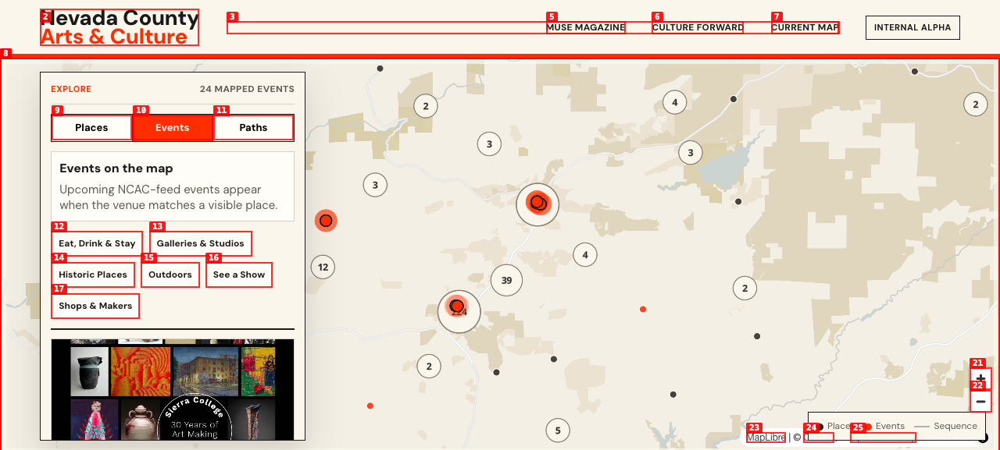
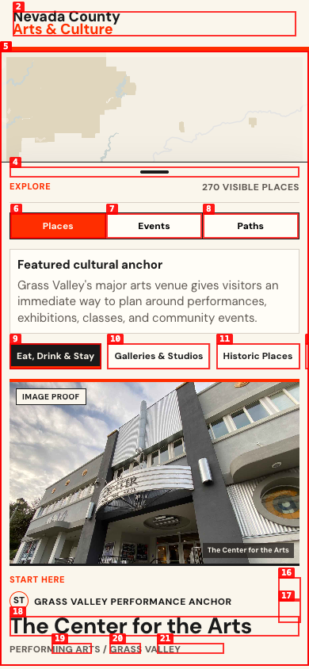

# Dogfood Report: V1 Discovery Map

| Field | Value |
|-------|-------|
| **Date** | 2026-05-25 |
| **App URL** | http://127.0.0.1:4173/index.html |
| **Session** | issue16-v1-discovery-map |
| **Scope** | Broad QA across Places, Events, and Paths for GitHub issue #16 |

## Summary

| Severity | Count |
|----------|-------|
| Critical | 0 |
| High | 0 |
| Medium | 1 |
| Low | 1 |
| **Total** | **2** |

## Issues

### ISSUE-001: Event card has typo and stray punctuation

| Field | Value |
|-------|-------|
| **Severity** | low |
| **Category** | content |
| **URL** | http://127.0.0.1:4173/index.html |
| **Repro Video** | N/A |

**Description**

In Events mode, the first event title renders as `Sierra College - NCC 30th Anniverary Legacy Art Show`. "Anniverary" appears to be a typo for "Anniversary". The same event card description also includes visible stray punctuation: `alumni. , In the Granucci Gallery...`.

**Repro Steps**

1. Navigate to the V1 Discovery Map and open Events mode.
   

2. **Observe:** The event card heading reads `Sierra College - NCC 30th Anniverary Legacy Art Show`, and the description includes `alumni. , In the Granucci Gallery...`.

---

### ISSUE-002: Place filter leaves non-matching featured card selected

| Field | Value |
|-------|-------|
| **Severity** | medium |
| **Category** | ux |
| **URL** | http://127.0.0.1:4173/index.html |
| **Repro Video** | N/A |

**Description**

In Places mode, applying the `Eat, Drink & Stay` filter updates the visible count to 270 and marks the filter active, but the panel still shows `Featured cultural anchor` and the selected card for `The Center for the Arts`, which is a Performing Arts place outside the active filter. This makes it unclear whether the filter applies to the detail panel or only the map layer.

**Repro Steps**

1. Navigate to the V1 Discovery Map in Places mode.

2. Click the `Eat, Drink & Stay` filter.
   

3. **Observe:** The count changes and the filter is active, but the detail card still shows `The Center for the Arts`.
